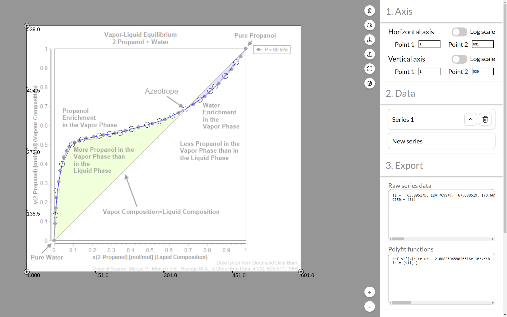

A service at [graphfitter.com](https://graphfitter.com) that allows you to paste in a graph, set the axes, add in multiple series and fit them to polynomials

## Features

- Autosaves current sketch
- Able to export and import graph files
- Axes have log scale option
- Polynomial fit generated using `np.polyfit`, with controllable degree

## Motivation

Graphfitter aims to help engineers and scientists at extracting data and equations from images of graphs. This makes it possible to quickly transition from sloppy eyeballing to writing robust and thoroughly-tested code. The hope is to convert every traditional math problem in engineering into a code problem, which can be directly attacked with deep learning methods.

## Support/Contact

Ethereum: 0x4834D0Bf5c37Ab052ea26435273c61A95125a3FC

Contact: 157239q@gmail.com
